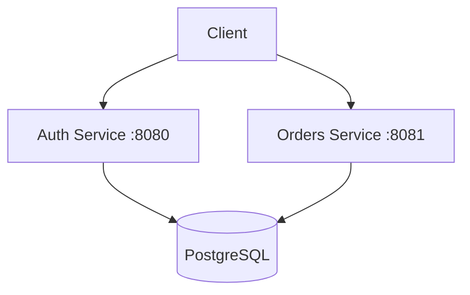

# Exchange Backend

A scalable microservices backend for a trading exchange platform built with Go, Docker, and Kubernetes.

## 📁 Project Structure

```
exchange-backend/
├── services/                    # Microservices
│   ├── auth/                    # Authentication service
│   │   ├── cmd/                 # Entry points
│   │   ├── internal/            # Private packages
│   │   ├── migrations/          # Database migrations
│   │   └── Dockerfile
│   └── orders/                  # Orders service
│       ├── cmd/
│       ├── internal/
│       ├── migrations/
│       └── Dockerfile
│
├── k8s/                         # Kubernetes manifests (Kustomize)
│   ├── base/                    # Shared base configs
│   ├── infrastructure/          # Shared infrastructure (Postgres)
│   ├── services/                # Per-service configs
│   │   ├── auth/
│   │   └── orders/
│   └── overlays/                # Environment-specific
│       ├── dev/
│       └── prod/
│
├── deploy/                      # Deployment configs
│   └── docker/                  # Docker Compose for local dev
│
├── skaffold.yaml                # Skaffold for K8s development
├── go.mod
└── go.sum
```

## 🚀 Quick Start

### Prerequisites

- Go 1.21+
- Docker & Docker Compose
- kubectl (for Kubernetes)
- Skaffold (optional, for K8s development)

### Run with Docker Compose (Local Development)

```bash
cd deploy/docker
docker compose up --build
```

**Services:**
- Auth: http://localhost:8080 (health: `/healthz`)
- Orders: http://localhost:8081 (health: `/healthz`)
- Postgres: localhost:5432

### Run with Kubernetes

#### Using Kustomize (Recommended)

```bash
# Development environment
kubectl apply -k k8s/overlays/dev

# Production environment
kubectl apply -k k8s/overlays/prod
```

#### Using Skaffold

```bash
# Development (hot reload)
skaffold dev

# Production build & deploy
skaffold run -p prod
```

## 🏗️ Adding a New Service

1. **Create service directory:**
   ```bash
   mkdir -p services/newservice/{cmd,internal,migrations}
   ```

2. **Add Dockerfile** in `services/newservice/Dockerfile`

3. **Add K8s manifests:**
   ```bash
   mkdir k8s/services/newservice
   # Create deployment.yaml, service.yaml, kustomization.yaml
   ```

4. **Update overlays** to include the new service:
   ```yaml
   # k8s/overlays/dev/kustomization.yaml
   resources:
     - ../../services/newservice
   ```

5. **Update skaffold.yaml** with new build artifact

6. **Update docker-compose.yml** if needed

## 📐 Architecture



## 🔧 Configuration

| Variable | Description | Default |
|----------|-------------|---------|
| `PORT` | Service port | 8080/8081 |
| `DATABASE_URL` | Postgres connection string | - |

## 📝 License

MIT
